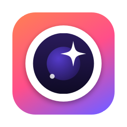
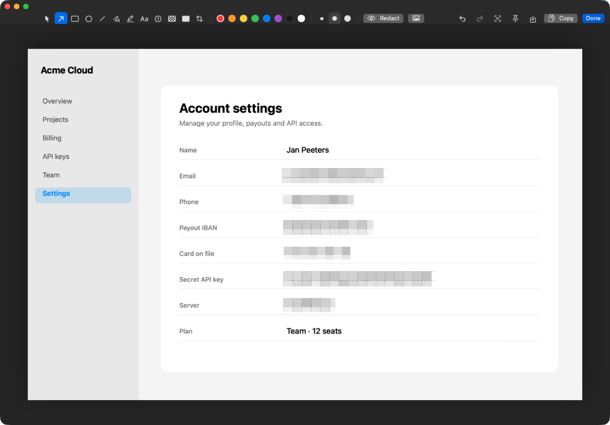
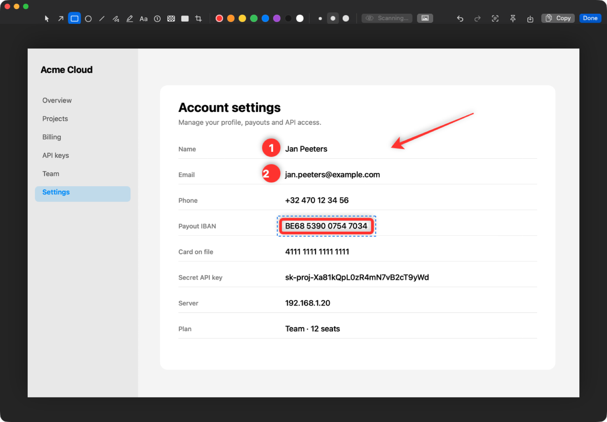
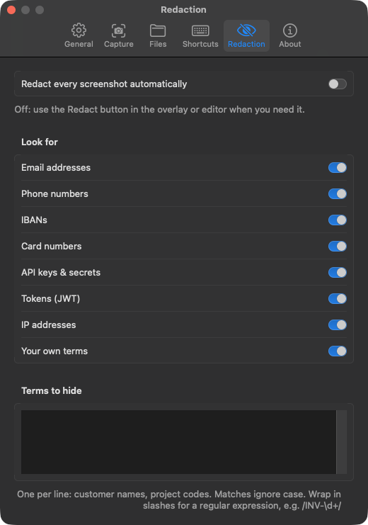

<p align="center">
  
</p>

<h1 align="center">Glint</h1>

<p align="center">
  <b>A free, open-source screenshot tool for macOS that blurs your secrets before you share them.</b><br>
  Capture, scroll-capture, record, annotate, pin and OCR. Emails, IBANs, card numbers and API keys get pixelated in one click, on-device.
</p>

<p align="center">
  
</p>

---

## Why

Every screenshot you drop into Slack, a GitHub issue or a support ticket is a small data
leak waiting to happen: a customer's email in the corner, an API key in a terminal, an
IBAN on an invoice. Blurring them by hand is tedious, so people don't.

Glint finds them for you. It reads the screenshot with Apple's on-device text recognition,
checks each match (IBANs and card numbers must pass their checksum, so an order number or
a timestamp doesn't get blurred), and pixelates it. Each redaction is an ordinary
annotation: move it, delete it, or add more.

## Features

**Capture**
- **Area**: freezes the screen first, so menus and hover states stay put. Crosshair,
  8× loupe with pixel coordinates and hex color, and a live size readout in pixels.
- **Window**: the window on its own, even when something covers it, with its shadow and
  transparent corners. Press <kbd>Space</kbd> during an area capture to switch.
- **Full screen** and **previous area** (the same rectangle again, for before/after shots).
- **Scrolling capture**: select a region, scroll, press Done. Frames are stitched as you
  go; sticky headers, footers and floating buttons are detected so they don't repeat, and
  repetitive content (logs, tables, numbered lists) still lines up exactly.
- **Screen recording** to MP4, with one-click **GIF** export.
- **Text (OCR)**: drag over anything and the text lands on your clipboard. QR codes are
  decoded, so you get the link rather than a picture of it.
- **Self-timer** (3, 5 or 10 s) for hover states and open menus.
- **Color picker**: press <kbd>C</kbd> while selecting to copy the hex color under the cursor.
- Optionally include the mouse pointer.

**After capture**
- **Quick access overlay**: a thumbnail in the corner. Drag it into any app, or hover to
  copy, save, annotate, pin, copy its text or redact it.
- Copies to the clipboard and saves to `~/Pictures/Glint`. Both can be turned off.
- **Pin to screen**: a floating, always-on-top copy. Drag to move, pinch to resize,
  scroll to fade, double-click to close.
- Annotate an image from your clipboard, a file, or a recent capture.

**Annotate**

<p align="center">
  
</p>

- Arrow, rectangle, ellipse, line, pen, highlighter, text, numbered steps, pixelate,
  black-out and crop, each with a single-key shortcut (<kbd>A</kbd>, <kbd>R</kbd>, <kbd>O</kbd>…).
- Tapered arrows and soft shadows, so annotations look good without fiddling.
- Select, move (arrow keys nudge), recolor and delete. Unlimited undo and redo.
- **Backgrounds**: a gradient frame with rounded corners and a shadow, for posts and docs.
- Retina-aware: files carry the right DPI, so a 2× shot shows at its real size in
  Keynote, Pages and Preview.

**Private by design**: no account, no network access, no analytics. OCR and redaction
run on your Mac.

**Light**: a 4 MB app using about 45 MB of memory and 0 % CPU when idle.

**Settings you can find things in**: six tabs (General, Capture, Files, Shortcuts,
Redaction, About). Every shortcut can be changed, files can be PNG or JPEG, Retina shots
can be saved at 1× size, and you can add your own terms to redact: customer names,
project codes, or any regular expression.

<p align="center">
  
</p>

## Shortcuts

| Action | Shortcut |
| --- | --- |
| Capture area | <kbd>⌃⇧4</kbd> |
| Capture window | <kbd>⌃⇧5</kbd> |
| Capture full screen | <kbd>⌃⇧3</kbd> |
| Capture previous area | <kbd>⌃⇧6</kbd> |
| Scrolling capture (press again to finish) | <kbd>⌃⇧7</kbd> |
| Capture text / QR code | <kbd>⌃⇧2</kbd> |
| Record screen (press again to stop) | <kbd>⌃⇧8</kbd> |

All of them can be changed in Settings → Shortcuts.

While selecting: <kbd>Space</kbd> switches between area and window mode, <kbd>⏎</kbd> takes
the whole screen, <kbd>C</kbd> copies the color under the cursor, <kbd>Esc</kbd> cancels.

In the editor: <kbd>⌘Z</kbd> / <kbd>⇧⌘Z</kbd> undo and redo, <kbd>⌘C</kbd> copies,
<kbd>⌘S</kbd> saves, <kbd>⌘⏎</kbd> finishes, <kbd>⌫</kbd> deletes the selection.

## Glint vs. CleanShot X

CleanShot X is excellent and does more. Here's where each one stands today:

| | Glint | CleanShot X |
| --- | --- | --- |
| Price | Free, MIT | Paid license |
| Area, window, full screen, previous area | ✓ | ✓ |
| Frozen screen while selecting, loupe | ✓ | ✓ |
| Quick access overlay, drag & drop | ✓ | ✓ |
| Annotate, numbered steps, pixelate, crop | ✓ | ✓ |
| Background frames | ✓ | ✓ |
| OCR, pin to screen | ✓ | ✓ |
| Scrolling capture | ✓ | ✓ |
| Screen recording, GIF | ✓ | ✓ |
| Custom shortcuts, self-timer, color picker, QR | ✓ | ✓ |
| **Automatic redaction of emails, IBANs, cards, keys, tokens + your own terms** | ✓ | – |
| Cloud upload & share links | – | ✓ |
| Recording audio, webcam overlay | – | ✓ |

## Install

Download `Glint.zip` from the [latest release](../../releases/latest), unzip, and move
`Glint.app` to `/Applications`. Requires macOS 14 Sonoma or later. Universal binary.

Glint isn't notarized yet, so macOS blocks the first launch. Right-click → **Open**, or:

```sh
xattr -dr com.apple.quarantine /Applications/Glint.app
```

On first capture macOS asks for **Screen Recording** permission. Allow it in System
Settings → Privacy & Security → Screen & System Audio Recording, then reopen Glint.

### Build from source

Only the Xcode Command Line Tools are needed, no full Xcode.

```sh
git clone https://github.com/brentc22/glint.git
cd glint
scripts/make-signing-cert.sh   # once: a stable local identity keeps the permission across rebuilds
make run                       # build, install to /Applications, launch
```

## How it works

| Piece | How |
| --- | --- |
| Capture | ScreenCaptureKit (`SCScreenshotManager`), all displays at native resolution, before the overlay appears |
| Scrolling capture | the region grabbed ~8×/s; per-row signatures, sticky bands found by comparing frames, offset from a distinctive anchor row, confirmed by rows matching *exactly* so repetitive content can't slip |
| Recording | `SCStream` → `AVAssetWriter` (H.264), frames written as they arrive; GIF via `AVAssetImageGenerator` + ImageIO |
| Window capture | `SCContentFilter(desktopIndependentWindow:)`, z-order from `CGWindowList` |
| Shortcuts | Carbon `RegisterEventHotKey`, which needs no Accessibility permission |
| OCR & redaction | Vision `VNRecognizeTextRequest` (language correction off, so keys stay intact), regex + IBAN mod-97 + Luhn, per-match boxes via `boundingBox(for:)` |
| Pixelate | exact block averages, not resampling, which would keep a real pixel per block |
| Rendering | one Core Graphics renderer, used by both the editor canvas and the export |

## Development

```sh
make test                                         # 30 unit tests: matcher, renderer, stitcher, undo, OCR, GIF
make bundle                                       # Glint.app in the repo root
Glint.app/Contents/MacOS/Glint --self-test        # every capture path for real, see below
open Glint.app --args --edit docs/demo-input.png  # editor on the demo image, no permission needed
```

`--self-test` captures every display, a window, a region 5× (timed), records 2 s of video
and turns it into a GIF, scroll-captures a 120-line window of its own and checks that
the result is exactly as tall as the document and that OCR reads it back. Started from a
terminal it uses the terminal's Screen Recording permission.

`docs/demo-input.png` is a made-up settings screen full of fake sensitive data
(`swift scripts/make-demo-image.swift` regenerates it). The test suite checks that Redact
finds exactly its six secrets and leaves the rest alone.

Other launch arguments: `--quick-access <image>`, `--settings <tab>` and
`--select-demo <image>` (the selection overlay over an image instead of your screen).

```
Sources/
  GlintCore/    annotations, renderer, redaction, OCR, undo; no AppKit, fully tested
  Glint/        the menu bar app: capture, overlay, editor, pin, settings
  GlintTests/   tests (a plain executable; XCTest needs full Xcode)
```

## Roadmap

- [ ] Audio (microphone / system) in recordings
- [ ] Hide desktop icons while capturing
- [ ] Measure tool (distances between UI elements)
- [ ] Bring-your-own-bucket upload (S3 / R2) for share links, opt-in
- [ ] Notarized builds and a Homebrew cask

Ideas and PRs welcome. Open an issue first for anything big.

## License

[MIT](LICENSE)
