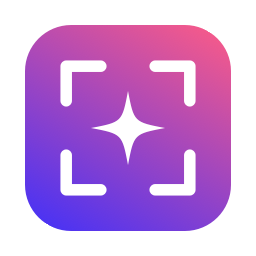
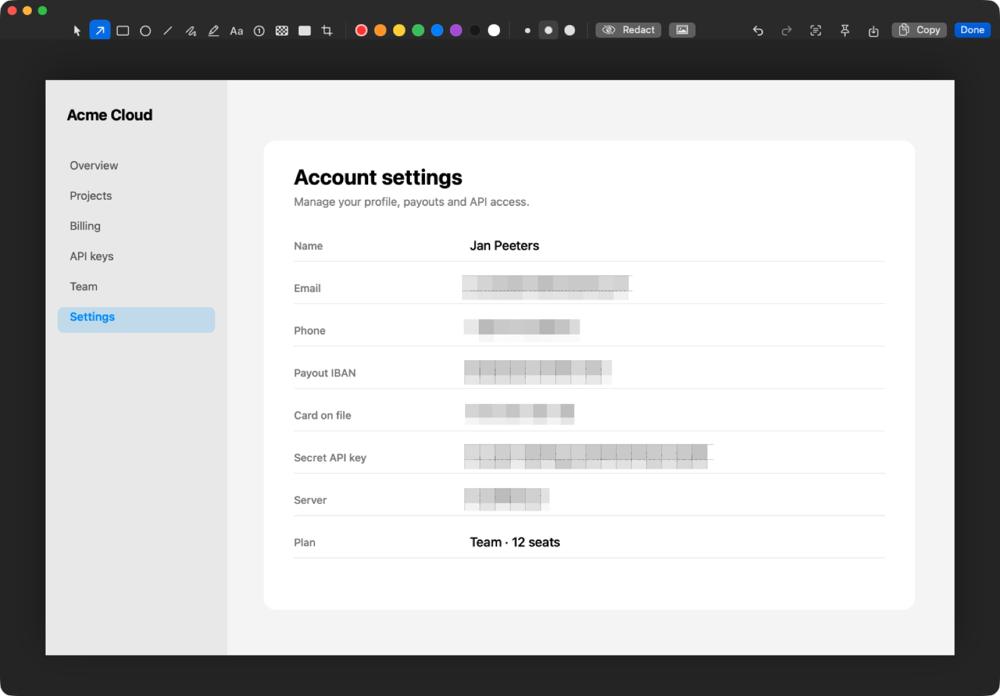
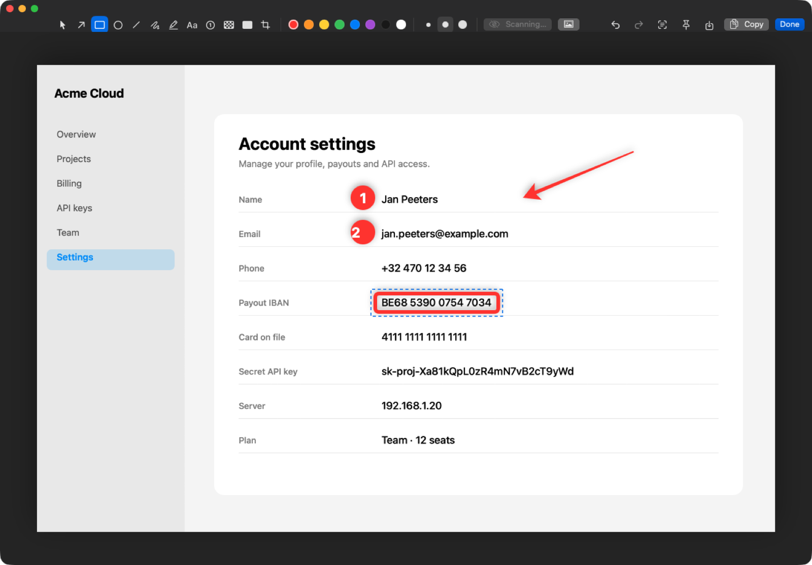
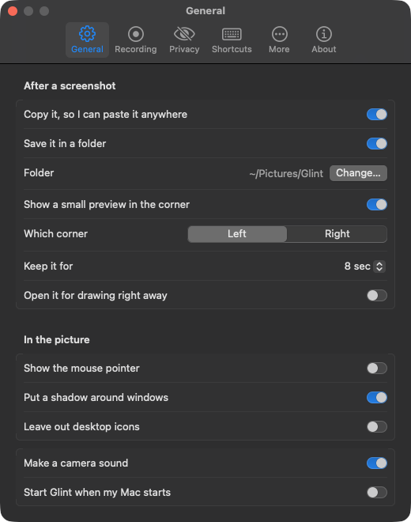

<p align="center">
  
</p>

<h1 align="center">Glint</h1>

<p align="center">
  <b>A free, open-source screenshot tool for macOS that blurs your secrets before you share them.</b><br>
  Capture, scroll-capture, record, annotate, pin and OCR. Emails, IBANs, card numbers and API keys get pixelated in one click, on-device.
</p>

<p align="center">
  
</p>

---

## Why

Every screenshot you drop into Slack, a GitHub issue or a support ticket is a small data
leak waiting to happen: a customer's email in the corner, an API key in a terminal, an
IBAN on an invoice. Blurring them by hand is tedious, so people don't.

Glint finds them for you. It reads the screenshot with Apple's on-device text recognition,
checks each match (IBANs and card numbers must pass their checksum, so an order number or
a timestamp doesn't get blurred), and pixelates it. Each redaction is an ordinary
annotation: move it, delete it, or add more.

## Features

**Capture**
- **Area**: freezes the screen first, so menus and hover states stay put. Crosshair,
  8× loupe with pixel coordinates and hex color, and a live size readout in pixels.
- **Window**: the window on its own, even when something covers it, with its shadow and
  transparent corners. Same shortcut as an area: drag for an area, click for the
  highlighted window.
- **Full screen** and **previous area** (the same rectangle again, for before/after shots).
- **Exact sizes**: press <kbd>R</kbd> while selecting for 1:1, 4:3, 16:9, 9:16, or a
  pixel-exact 1280×720 or 1920×1080 box that follows the pointer.
- **Scrolling capture**: select a region, scroll, press Done. Frames are stitched as you
  go; sticky headers, footers and floating buttons are detected so they don't repeat, and
  repetitive content (logs, tables, numbered lists) still lines up exactly. **Auto**
  scrolls to the end for you.
- **Screen recording** to MP4 at 30 or 60 fps, with your Mac's sound and your voice
  (mixed into one track), pause and resume, a 3-2-1 countdown, click rings, the shortcuts
  you press (never plain typing) and a webcam bubble. **Trim** without re-encoding and
  one-click **GIF** export.
- **Text (OCR)**: drag over anything and the text lands on your clipboard. QR codes are
  decoded, so you get the link rather than a picture of it.
- **Self-timer** (3, 5 or 10 s) for hover states and open menus.
- **Color picker**: press <kbd>C</kbd> while selecting to copy the hex color under the cursor.
- Optionally include the mouse pointer, or leave out desktop icons and widgets (only in the
  capture; Finder isn't restarted).

**After capture**
- **Quick access overlay**: a thumbnail in the corner. Drag it into any app, or hover to
  copy, save, annotate, pin, copy its text or redact it.
- Copies to the clipboard and saves to `~/Pictures/Glint`. Both can be turned off.
- **Pin to screen**: a floating, always-on-top copy. Drag to move, pinch to resize,
  scroll to fade, double-click to close.
- Annotate an image from your clipboard, a file, or a recent capture.
- **Capture History**: every capture by day, searchable by the text *inside* the
  screenshots, read on-device.
- **Share links** (opt-in): upload to your own Cloudflare R2, S3, B2 or MinIO bucket and
  copy the link. Unguessable names, the secret in the Keychain, redacted by default.

**Annotate**

<p align="center">
  
</p>

- Arrow, rectangle, ellipse, line, pen, highlighter, spotlight, text, numbered steps, blur,
  pixelate, black-out and crop, each with a single-key shortcut (<kbd>A</kbd>, <kbd>R</kbd>, <kbd>O</kbd>…).
- **Blur and pixelate are both safe**: each is drawn only from block averages of the pixels
  underneath, so neither can be sharpened back into readable text.
- Tapered arrows and soft shadows, so annotations look good without fiddling.
- Select, move (arrow keys nudge), recolor and delete. Unlimited undo and redo.
- **Backgrounds**: a gradient frame with rounded corners and a shadow, for posts and docs.
- Retina-aware: files carry the right DPI, so a 2× shot shows at its real size in
  Keynote, Pages and Preview.

**Private by design**: no account, no analytics, and no uploads unless you set up share
links yourself. The only request Glint makes on its own is a daily update check (see
[Updates](#updates)). OCR and redaction run on your Mac.

**Light**: a small app using about 45 MB of memory and 0 % CPU when idle.

**Settings anyone understands**: six tabs (General, Recording, Privacy, Shortcuts, More,
About), in plain words — "Copy it, so I can paste it anywhere", not "Copy to clipboard".
File formats, animation and share-link setup wait under More.

<p align="center">
  
</p>

## Shortcuts

| Action | Shortcut |
| --- | --- |
| Capture area or window (drag or click) | <kbd>⇧⌘4</kbd> |
| Capture full screen | <kbd>⇧⌘3</kbd> |
| Record screen (press again to stop) | <kbd>⇧⌘5</kbd> |
| Capture window only | <kbd>⌃⇧5</kbd> |
| Capture previous area | <kbd>⌃⇧6</kbd> |
| Scrolling capture (press again to finish) | <kbd>⌃⇧7</kbd> |
| Capture text / QR code | <kbd>⌃⇧2</kbd> |

⇧⌘3, ⇧⌘4 and ⇧⌘5 are the macOS keys, so turn off macOS's own under System Settings →
Keyboard → Keyboard Shortcuts → Screenshots; Glint's Shortcuts settings flag them while
they're still on. All of them can be changed in Settings → Shortcuts.

While selecting: <kbd>Space</kbd> switches to windows only (and back), <kbd>⏎</kbd> takes
the whole screen, <kbd>R</kbd> cycles aspect ratios and exact sizes, <kbd>C</kbd> copies the
color under the cursor, <kbd>Esc</kbd> cancels.

In the editor: <kbd>⌘Z</kbd> / <kbd>⇧⌘Z</kbd> undo and redo, <kbd>⌘C</kbd> copies,
<kbd>⌘S</kbd> saves, <kbd>⌘⏎</kbd> finishes, <kbd>⌫</kbd> deletes the selection.

## Glint vs. CleanShot X

CleanShot X is excellent. Here's where each one stands today:

| | Glint | CleanShot X |
| --- | --- | --- |
| Price | Free, MIT | Paid license |
| Area, window, full screen, previous area | ✓ | ✓ |
| Frozen screen while selecting, loupe | ✓ | ✓ |
| Quick access overlay, drag & drop | ✓ | ✓ |
| Annotate, numbered steps, pixelate, crop | ✓ | ✓ |
| Background frames | ✓ | ✓ |
| OCR, pin to screen | ✓ | ✓ |
| Scrolling capture | ✓ | ✓ |
| Screen recording, GIF, trim | ✓ | ✓ |
| Recording audio, pause, clicks, keystrokes, webcam | ✓ | ✓ |
| Auto-scrolling capture, fixed sizes and ratios, hide desktop icons | ✓ | ✓ |
| Blur, spotlight | ✓ | ✓ |
| Share links | ✓ your own bucket | ✓ their cloud |
| Custom shortcuts, self-timer, color picker, QR | ✓ | ✓ |
| **Automatic redaction of emails, IBANs, cards, keys, tokens + your own terms** | ✓ | – |
| **Blur that can't be sharpened back** (built from block averages) | ✓ | – |
| **History searchable by the text in your screenshots** | ✓ | – |
| **Keystrokes that never show plain typing** (passwords stay out of videos) | ✓ | – |
| **Shared copies redacted automatically** | ✓ | – |

## Install

Download `Glint.zip` from the [latest release](../../releases/latest), unzip, and move
`Glint.app` to `/Applications`. Requires macOS 14 Sonoma or later. Universal binary.

Glint isn't notarized yet, so macOS blocks the first launch. Right-click → **Open**, or:

```sh
xattr -dr com.apple.quarantine /Applications/Glint.app
```

On first capture macOS asks for **Screen Recording** permission. Allow it in System
Settings → Privacy & Security → Screen & System Audio Recording, then reopen Glint.

### Updates

Glint checks GitHub Releases once a day for a newer version. When there is one, it shows
the release notes with **Install and Relaunch** (download, check and swap the app, then
relaunch), **Later**, and **Skip This Version** (stay quiet about it until you check
yourself). A waiting update also shows at the top of the menu bar menu. Settings → General
→ Updates turns the daily check off and has **Check Now**.

Before swapping anything in, Glint checks that the download is `com.brentc22.Glint`, the
version the release promised, and that its code signature is intact
(`codesign --verify --deep --strict`). If any of that fails, or `/Applications` isn't
writable, it offers the download page instead.

Release builds are ad-hoc signed, so macOS treats a new version as a new app and asks for
Screen Recording again; right after such an update Glint opens its settings on the
permission banner. If the `Glint Self-Signed` identity from
`scripts/make-signing-cert.sh` is in your keychain, Glint re-signs the checked update with
it, and the permission carries over.

### Build from source

Only the Xcode Command Line Tools are needed, no full Xcode.

```sh
git clone https://github.com/brentc22/glint.git
cd glint
scripts/make-signing-cert.sh   # once: a stable local identity keeps the permission across rebuilds
make run                       # build, install to /Applications, launch
```

## How it works

| Piece | How |
| --- | --- |
| Capture | ScreenCaptureKit (`SCScreenshotManager`), all displays at native resolution, before the overlay appears |
| Scrolling capture | the region grabbed ~8×/s; per-row signatures, sticky bands found by comparing frames, offset from a distinctive anchor row, confirmed by rows matching *exactly* so repetitive content can't slip |
| Recording | `SCStream` → `AVAssetWriter` (H.264 + AAC), frames written as they arrive; pause shifts later timestamps back; system audio and microphone mixed to one track with `AVAssetReaderAudioMixOutput`, video copied as is; trim via a passthrough `AVAssetExportSession`; GIF via `AVAssetImageGenerator` + ImageIO |
| Click rings, keystrokes, webcam | Glint windows the recorder is told to keep, while it leaves out its own HUD |
| Hide desktop icons | Finder's windows at the desktop-icon level (and widgets just above) go on the capture's exclude list |
| History search | Vision OCR per file, cached by path and modification date; every query word must match, ignoring case and accents |
| Share links | AWS Signature V4 with CryptoKit, no SDK; tested against AWS's reference vectors |
| Window capture | `SCContentFilter(desktopIndependentWindow:)`, z-order from `CGWindowList` |
| Shortcuts | Carbon `RegisterEventHotKey`, which needs no Accessibility permission |
| OCR & redaction | Vision `VNRecognizeTextRequest` (language correction off, so keys stay intact), regex + IBAN mod-97 + Luhn, per-match boxes via `boundingBox(for:)` |
| Pixelate & blur | exact block averages, not resampling, which would keep a real pixel per block; blur smooths the averages with Core Image, never the original |
| Rendering | one Core Graphics renderer, used by both the editor canvas and the export |

## Development

```sh
make test                                         # 54 unit tests: matcher, renderer, stitcher, undo, OCR, GIF, SigV4, updater…
make bundle                                       # Glint.app in the repo root
Glint.app/Contents/MacOS/Glint --self-test        # every capture path for real, see below
open Glint.app --args --edit docs/demo-input.png  # editor on the demo image, no permission needed
```

`--self-test` captures every display, a window, a region 5× (timed), records video with
system audio and a pause (which must not show up in its length), checks that click rings
and shortcuts land in the video, mixes two audio tracks into one, trims, makes a GIF,
scroll-captures a 120-line window of its own by hand and with Auto (both must come out
exactly as tall as the document, and OCR must read it back), and checks that desktop
icons can be left out. Started from a terminal it uses the terminal's Screen Recording
(and, for Auto, Accessibility) permission. With `GLINT_UPLOAD_TEST="endpoint bucket key
secret"` it also uploads to that bucket.

`docs/demo-input.png` is a made-up settings screen full of fake sensitive data
(`swift scripts/make-demo-image.swift` regenerates it). The test suite checks that Redact
finds exactly its six secrets and leaves the rest alone.

Other launch arguments: `--quick-access <image>`, `--settings <tab>`, `--history`, `--trim <video>` and
`--select-demo <image>` (the selection overlay over an image instead of your screen).

```
Sources/
  GlintCore/    annotations, renderer, redaction, OCR, undo; no AppKit, fully tested
  Glint/        the menu bar app: capture, overlay, editor, pin, settings
  GlintTests/   tests (a plain executable; XCTest needs full Xcode)
```

## Roadmap

- [x] Audio (microphone / system) in recordings
- [x] Hide desktop icons while capturing
- [x] Bring-your-own-bucket upload (S3 / R2) for share links, opt-in
- [ ] Measure tool (distances between UI elements)
- [ ] Combine several screenshots on one canvas
- [ ] Notarized builds and a Homebrew cask

Ideas and PRs welcome. Open an issue first for anything big.

## License

[MIT](LICENSE)
